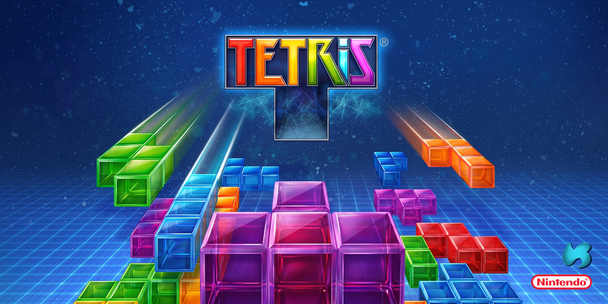
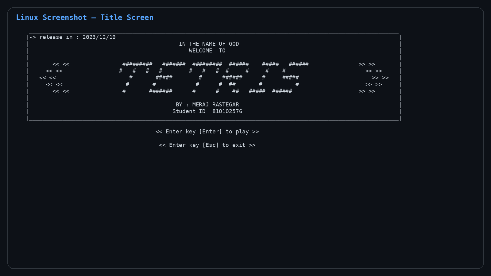
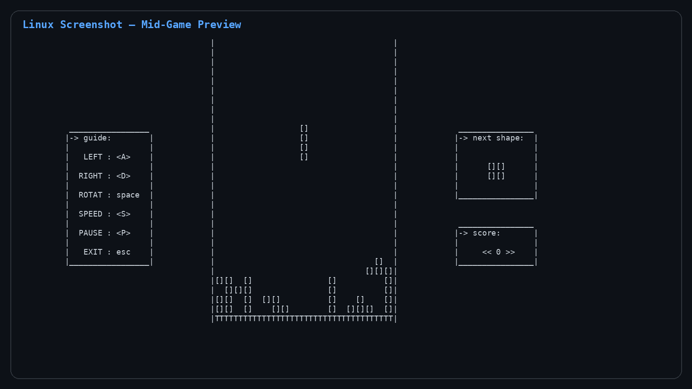

# 🧱 TETRIS (C Console Game)

> **Basic Programming - University of Tehran - Department of Electrical & Computer Engineering**

  

## 📌 Overview

This repository contains a console-based implementation of the classic **TETRIS** game, developed in **C** using keyboard-driven terminal input. This project was carried out as the *Second Project* for the *Basic Programming* course at the University of Tehran.

A compact recreation of the core **TETRIS** gameplay loop, built from scratch in **C11** using a fixed terminal board, falling pieces, row clearing, score tracking, next-shape preview, pause/restart flow, and game-over detection.

This project was developed as part of my academic and personal exploration into **basic game development, procedural programming, terminal rendering, keyboard input handling, and cross-platform console behavior**.



## 🎮 Features

- Classic **falling-block gameplay**: move and rotate pieces, complete rows, and keep the board from filling up.
- Implemented core mechanics:
  - 🧩 **O, I, Z, and T shapes** from the original submitted version.
  - 🕹️ **Left/right movement**, speed control, and shape rotation.
  - 🕵️ **Row-completion detection**, row deletion, and score updates.
  - ⏭️ **Next-shape preview** beside the main board.
  - ⚙️ **Pause, restart, and exit flow** through keyboard commands.
- Terminal-based board system with a fixed play area, guide panel, score panel, and preview panel.
- Console color feedback for gameplay events, including the green score flash and red game-over screen behavior from the original Windows version.
- Modular C structure separating gameplay logic, console compatibility, and the main game loop.
- Linux-compatible terminal input and ANSI color layer while preserving the original Windows console behavior.
- Lightweight smoke tests for core board and gameplay helpers.

## 🛠️ Tech Stack

- **Language:** C11
- **Interface:** Linux Terminal / Windows Console with ANSI/Win32 color feedback
- **Build System:** Makefile
- **Compiler:** GCC / MinGW GCC
- **OS Compatibility:** Linux (tested), should work on Windows with MinGW installed

## 🚀 Getting Started

### 1. Clone the repository

```bash
git clone https://github.com/mragetsars/TETRIS.git
cd TETRIS
```

### 2. Install dependencies

For Ubuntu/Linux:

```bash
sudo apt-get update
sudo apt-get install build-essential make
```

For Windows, install **MinGW GCC** and make sure `mingw32-make` is available from the terminal.

### 3. Build and Run the game

On Linux:

```bash
make clean #Clean build files
make
./tetris.out
```

On Windows with MinGW GCC:

```bash
mingw32-make clean
mingw32-make
.\tetris.exe
``` 

## 📁 Repository Structure

The project is organized as follows:

```text
TETRIS/
├── src/                     # C implementation files
│   ├── main.c               # Game entry point and input loop
│   ├── tetris.c             # Core board, shape, score, and render logic
│   └── console.c            # Windows/POSIX console compatibility layer
├── include/                 # Header files (.h)
│   ├── tetris.h             # Game constants and gameplay declarations
│   └── console.h            # Console abstraction interface
├── files/                   # README cover and visual assets
│   ├── README.png           # README cover image
│   └── screenshots/         # README gameplay preview images
│       ├── linux-title-screen.png
│       └── linux-gameplay-screen.png
├── tests/                   # Logic-level smoke tests
│   └── test_tetris_logic.c  # Basic verification for gameplay helpers
├── obj/                     # Test/build artifacts generated by make
├── Makefile                 # Build system configuration
├── .gitignore               # Ignored build, binary, editor, and OS artifacts
├── .gitattributes           # Line-ending normalization rules
└── README.md                # Project documentation
```

## 🎨 Screenshots

<p align="center">
  
  
</p>

## 📖 Future Improvements

- Add the full seven-piece modern TETRIS shape set.
- Add persistent high-score storage.
- Improve terminal rendering polish and add optional color themes.
- Add menu polish, difficulty levels, and cleaner end-game screens.
- Add automated input-driven gameplay tests.

## 🙌 Acknowledgments

- Inspired by the classic **TETRIS** game.
- Built with ❤️ using **C** and terminal-based input/output.
- By **[Meraj Rastegar](https://github.com/mragetsars)**